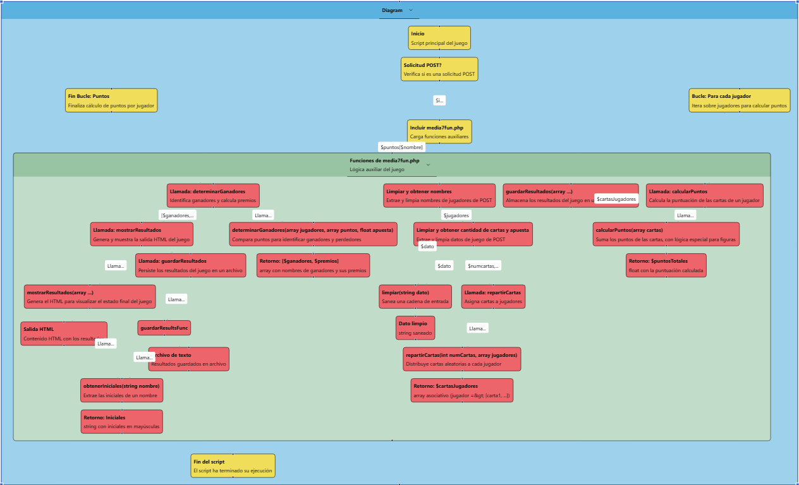

## Vista previa de la estructura de lógica

# Siete y Media

Juego de cartas online para 4 jugadores hecho en PHP.

## Archivos

- `media7.html` - Página del juego
- `media7.php` - Maneja la lógica
- `media7fun.php` - Funciones
- `images/` - Cartas
- `bootstrap.min.css` - Estilos
- `Ficheros/` - Archivos de texto de la jugada

## Cómo jugar

- Introduce los nombres de 4 jugadores
- Elige el número de cartas
- Haz tu apuesta
- El As vale 1, las figuras 0.5 y el resto su valor
- Intenta acercarte a 7.5

## Premios

- Premio normal: 50% del bote
- Premio especial: 80% si sacas 7.5
- Sin ganador: el dinero va al bote

## Resultados

Los resultados se guardan en `Ficheros/apuestas_fecha.txt` con las iniciales de los jugadores y sus premios.
